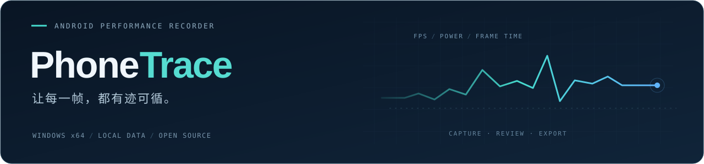

**手机运行游戏，电脑记录性能。**

免费开源 · 解压即用 · 无需 Root · 无需安装 Python

[**下载 Windows 版 ↗**](https://github.com/hanxiaoyu-cmd/PhoneTrace/releases/tag/v0.1.1)　 /　 [快速上手](docs/quick-start.md)　 /　 [数据口径](docs/accuracy.md)

## 一次记录，看清表现

| 观测维度 | 记录内容 |
| :-- | :-- |
| `FRAMES` | FPS · 帧时间 · P95 · 慢帧 |
| `POWER` | 电池端功率估算 · 电流 · 电压 · 电池温度 · 电量 |
| `SYSTEM` | 整机 CPU · 应用 PSS 内存 |
| `REPORT` | 实时曲线 · 历史回看 · CSV / JSONL / HTML |

**数据有来源，缺失有说明。** 记录保存在本机；不可读取的指标留空，保留原因和有效采集时长。

<b>查看界面 ↗</b>　演示模式 · 模拟数据

 

图中为模拟数据，不代表手机实测结果。

## 三步开始

1. **解压运行** — 下载便携包，保留完整文件夹，双击 `PhoneTrace.exe`。
2. **连接手机** — 开启 USB 调试并授权电脑，在软件中刷新、选择设备。
3. **开始记录** — 手机进入游戏，点击「识别前台」→「开始记录」。

没有连接手机？勾选「演示模式」即可体验。电脑需 Windows 10 1809+ / Windows 11 x64，指标可用性取决于手机系统权限。

> **测功率：先无线连接，再断开外部电源。** USB 供电时不计算整机放电功率。已验证一台小米 Android 16 手机的帧率与电流读取；放电功率尚未完成真机验证或仪器校准。[查看验证范围 →](VALIDATION.md)

---

[快速上手](docs/quick-start.md) · [指标与准确性](docs/accuracy.md) · [开发与构建](docs/development.md) · [参与贡献](CONTRIBUTING.md) · [更新记录](CHANGELOG.md)

[MIT License](LICENSE) · 第三方组件遵循[各自许可证](THIRD_PARTY.md)。
