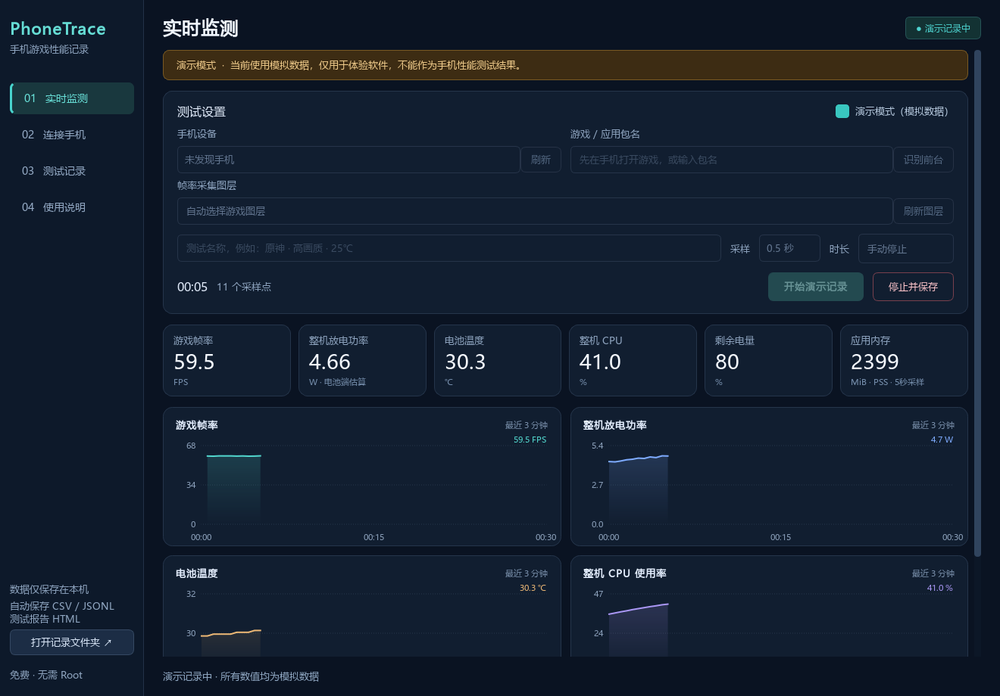

# 帧迹 PhoneTrace

**手机玩游戏，电脑看曲线、存数据。** 一款免费开源的 Windows 安卓手机性能记录工具：双击打开，连接手机，开始记录。

易上手、信息完整、数据准确优先。PhoneTrace 把数据来源、计算口径和缺失原因一起保存，让每次测试都能回看、导出和复核。

A free, open-source Windows desktop recorder for Android game performance, with live charts, local reports, and transparent measurement methods.

[下载 Windows 便携版](https://github.com/hanxiaoyu-cmd/PhoneTrace/releases/tag/v0.1.1) · [快速上手](docs/quick-start.md) · [指标与准确性](docs/accuracy.md) · [验证记录](VALIDATION.md)



*截图为演示模式，所有数值均为模拟数据，不代表任何手机的测试结果。*

## 为什么用 PhoneTrace

| 你关心的事 | PhoneTrace 的做法 |
| --- | --- |
| **上手简单** | 便携版解压后双击；中文界面，支持识别前台游戏、自动选择图层、USB 和无线调试连接。无需安装 Python、注册账号、订阅或 Root，也不需要手机端 APK。 |
| **记录完整** | 帧率、帧时间、慢帧、功耗估计、电流、电压、温度、电量、CPU、应用内存集中记录；实时曲线、历史回看、CSV 数据和独立 HTML 报告一起提供。 |
| **准确优先** | 游戏图层呈现时间戳用于计算 FPS；功耗仅在确认电池放电时计算；记录数据源、采集覆盖情况和警告，缺失值保留为空。 |
| **数据归你** | 数据保存在电脑本地，报告离线可打开；流式写入保留已采集数据，便于在断连或中断后复核。 |

> 已在一台小米 Android 16 手机的原神场景验证游戏图层帧率读取，并确认系统电池服务可读取电流。**尚未完成拔线放电功率的真机验证或参考仪器校准**，其他机型仍需适配验证。不同 Android / HyperOS 版本开放的接口不同；“准确优先”是实现原则，不代表仪器级测量能力。

## 三步开始

1. **打开软件**：从 [Releases](https://github.com/hanxiaoyu-cmd/PhoneTrace/releases) 下载 Windows x64 便携包，解压后双击 `PhoneTrace/PhoneTrace.exe`。请保留整个程序文件夹。
2. **连接手机**：开启手机的 USB 调试，使用数据线连接电脑，在手机上允许调试。软件点击刷新并选择设备。
3. **开始测试**：手机进入游戏场景，软件点击“识别前台”，确认游戏包名后点击“开始记录”。结束时点击“停止并保存”。

还没连接手机？勾选 **演示模式** 即可体验曲线和记录流程；演示数据会明确标注为模拟。

**要记录功耗估计，先完成无线调试连接，再拔掉 USB 线。** 外接电源会改变电池供电状态，USB 连接期间的电池电流不能直接代表游戏整机功耗。详细连接步骤和常见问题见 [快速上手](docs/quick-start.md)。

## 能看到哪些信息

以下是软件支持的数据项；手机系统允许读取时才会显示，无法读取时显示 `—` 并保留原因。

| 指标 | 数据来源与口径 |
| --- | --- |
| FPS | 所选游戏图层的 SurfaceFlinger 实际呈现时间戳计算的观测帧率 |
| 帧时间 / P95 | 新观测帧间隔的平均值 / 第 95 百分位，单位 ms |
| 慢帧 | 观测帧间隔大于 50 ms 的次数，不等同于其他工具的 Jank 定义 |
| 功耗估计 W | 确认未接外部电源且正在放电时，电池电压 × 电流绝对值 |
| 电流 mA / 电压 V | 优先读取电池节点；受限时尝试系统电池服务。保留电流符号和来源 |
| 电量 % / 电池温度 ℃ | Android 电池服务或电池节点报告的值 |
| CPU % | 可读取时的整机 CPU 使用率，非游戏进程独占使用率 |
| 应用内存 MiB | 可读取时的游戏 PSS 内存，每 5 秒采样 |

功耗是**整机电池放电功率估计**，包含屏幕、网络和其他进程，不是 SoC 独占功耗。FPS 反映所选图层的呈现节奏，开启插帧时不能据此推断游戏引擎原生渲染 FPS。

PhoneTrace 不用屏幕刷新率代替游戏帧率，不猜测双电芯倍率，不把缺失数据补成零，也不会因读取失败自动切换到模拟数据。帧缓冲区容量、ADB 速度和系统权限仍会影响采集完整性；当前不提供无法可靠获取的 GPU 利用率。完整方法、公式和限制见 [指标与准确性](docs/accuracy.md)。

## 每次测试都留下可复核的数据

默认保存到软件旁的 `records` 目录；不可写时保存到 `%LOCALAPPDATA%/PhoneTrace/records`。界面显示实际路径，并可直接打开文件夹。

```text
records/一次测试/
├── samples.csv          # 采样数据，Excel 可打开
├── samples.jsonl        # 持续写入的原始记录
├── frame_intervals.csv  # 实际观测到的新帧间隔
├── metadata.json        # 设备、设置、单位与数据口径
├── summary.json         # 统计、覆盖情况与结束状态
└── report.html          # 离线曲线报告
```

软件提供实时监测和历史回看。报告区分测试总时长与有效采集时长，平均功耗排除缺失值和长时间中断。连续三次读取失败后会结束测试并保留已写入记录。

## 运行要求

- **电脑**：Windows x64；Windows 10 1809 或更新版本、Windows 11，依据 [Qt 6.11 支持范围](https://doc.qt.io/qt-6/windows.html)。目前仅在开发用 Windows 11 电脑验证过。
- **手机**：可开启 ADB 调试的 Android 手机；可用指标取决于系统权限。Android 11+ 可使用系统无线调试配对。
- **便携版**：包含程序运行库与 ADB，无需另装 Python。源码运行需自行准备依赖与官方 Platform Tools。

项目面向支持 ADB 的 Android 设备，不限于小米，也不代表已适配所有机型。

## 从源码运行与构建

推荐 Python 3.11 或 3.12、Windows x64。在仓库根目录执行：

```powershell
python -m venv .venv
.\.venv\Scripts\python.exe -m pip install -r requirements-dev.txt
.\.venv\Scripts\python.exe main.py
```

将官方 [Android Platform Tools](https://developer.android.com/tools/releases/platform-tools) 解压到 `tools/platform-tools`，或通过 `ANDROID_SDK_ROOT` / `PATH` 提供 ADB。构建便携包时需要 `tools/platform-tools` 中的 ADB 和配套文件。

```powershell
# 测试
.\.venv\Scripts\python.exe -m pytest -q

# 构建 Windows 便携程序
.\build.ps1 -OutputRoot dist/v0.1.1

# 生成完整 ZIP 便携包与 SHA-256 校验文件
.\.venv\Scripts\python.exe scripts/package_release.py --dist-root dist/v0.1.1

# 以模拟数据体验采集，保存到独立测试目录
.\.venv\Scripts\python.exe main.py --demo --demo-seconds 10 --data-dir test-output/demo
```

以上命令输出为 `dist/v0.1.1/PhoneTrace/PhoneTrace.exe`。构建会拒绝覆盖已有程序目录，以保护运行中的软件和用户记录；再次构建请指定新的输出目录。便携包中的 `source` 目录也提供源码和构建资源。验证项目及尚未验证的范围见 [VALIDATION.md](VALIDATION.md)。

## 反馈与贡献

欢迎提交问题、真机兼容性结果与改进，详见 [贡献指南](CONTRIBUTING.md)。反馈读取问题时，请提供手机型号、Android / HyperOS 版本、软件版本、连接方式、游戏包名，以及对应记录中的警告。分享文件前请检查设备标识、局域网地址和自己填写的测试标题。

对采集方法的改动，请同时说明数据来源、单位、缺失值处理方式，并提供可复核的测试。真实、可解释的数据比更多没有依据的数字更有价值。

## 开源许可与官方资料

PhoneTrace 自有源码采用 [MIT License](LICENSE)。第三方组件各自的许可与再分发说明见 [THIRD_PARTY.md](THIRD_PARTY.md) 和 `licenses/`。

- [Android ADB 与无线调试](https://developer.android.com/tools/adb)
- [Android SDK Platform Tools](https://developer.android.com/tools/releases/platform-tools)
- [Linux 电池节点及单位](https://docs.kernel.org/power/power_supply_class.html)
- [AOSP SurfaceFlinger FrameTracker](https://android.googlesource.com/platform/frameworks/native/+/refs/heads/main/services/surfaceflinger/FrameTracker.cpp)
- [Qt for Python](https://doc.qt.io/qtforpython-6/)

本项目与小米、Google、Qt 及游戏发行商无隶属关系。
